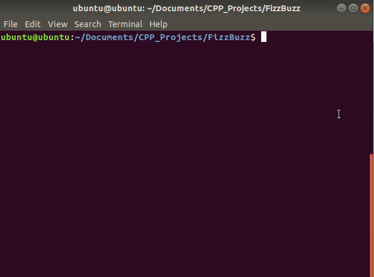

# FizzBuzz

Folder Structure
```
FizzBuzz
|  FizzBuzz.cpp (C++ source code file)
|  FizzBuzz_Demo.gif (Output from the program)
|  Makefile (helpful file for compiling the C++ program)
|  README.md (Contains information about the program)

```

### Table of Contents
1. [Purpose](#Purpose)
2. [Extracted Requirements](#Extracted_Requirements)
3. [Run Instructions](#Run_Instructions)
4. [Program Demo](#Program_Demo)
5. [Code](#Code)

### Purpose <a name="Purpose"></a>

Develop a program that prints the numbers in the given range. But for multiples of three print "Fizz" instead of the number and for the multiples of five print "Buzz". For numbers which are multiples of both three and five print "FizzBuzz". Print a new line after each string or number.

**Input Format** First line will be the number of testcases, T. Next line will have T integers, denoted by N.

**Output Format** For each testcase, print the number from 1 to N. But follow the rules given in the problem statement.

**Constraints**

1 <= T <= 10

N is an integer.

**Expected Output**

| Sample Input | Sample Output |
|--------------|---------------|
| 2            | 1             |
| 3 15         | 2             |
|              | Fizz          |
|              | 1             |
|              | 2             |
|              | Fizz          |
|              | 4             |
|              | Buzz          |
|              | Fizz          |
|              | 7             |
|              | 8             |
|              | Fizz          |
|              | Buzz          |
|              | 11            |
|              | Fizz          |
|              | 13            |
|              | 14            |
|              | FizzBuzz      |

### Extracted Requirements <a name="Extracted_Requirements"></a>

1. `N` is a multiple of 3, then print "Fizz". `N % 3 == 0` &rightarrow; "Fizz"
2. `N` is a multiple of 5, then print "Buzz". `N % 5 == 0` &rightarrow; "Buzz"
3. `N` is a multiple of 3 and 5, then print "FizzBuzz". `(N % 3 == 0) and (N % 5 == 0)` &rightarrow; "FizzBuzz"
4. `N` is not a multiple of 3 or 5, then print `N`. `(N % 3 != 0) and (N % 5 != 0)` &rightarrow; `N`

### Run Instructions <a name="Run_Instructions"></a>

Use the provided `Makefile` and `make` command to automatically compile the C++ code on your linux machine. After the compile is successful you can run the program using `./FizzBuzz` command in your native terminal. Below is a description of all the supported make commands by the provided makefile.

`make all`: compiles the C++ file into an executable file, `FizzBuzz`

`make run`: compiles the C++ file into an executable file, `FizzBuzz` and starts the `FizzBuzz` program

`make clean`: removes all of the compiled files, `FizzBuzz`. Keeps the source code intact.


### Program Demo <a name="Program_Demo"></a>



### Code <a name="Code"></a>
```cpp
#include <iostream> // For Input Output with user

// This function returns a String after checking whether the provided integer is a Fizz, Buzz, both or none
std::string check_fizz_buzz(int num)
{
   std::string return_var = ""; // Return var declaration

   bool is_fizz = (num % 3) == 0; // Is the provided number a Fizz
   bool is_buzz = (num % 5) == 0; // Is the provided number a Buzz

   if(is_fizz && is_buzz) // Num is a fizz and a buzz
   {
      return_var = "FizzBuzz";
   }
   else if(is_fizz) // Num is a fizz
   {
      return_var = "Fizz";
   }
   else if(is_buzz) // Num is a buzz
   {
      return_var = "Buzz";
   }
   else // Num is neither
   {
      return_var = std::to_string(num); // Convert int to string and return String that contains the num
   }

   return return_var; // Return the value
}

int main()
{
   int T; // Declare the number of testcases as T

   std::cin >> T; // Get the value of T from the user

   // Check if the value of T is outside the range of 1 <= T <= 10, if outside exit the program with error code.
   if ((T < 1) || (T > 10))
   {
      return 1; // Exit the program and halt execution with error code
   }

   int num[T]; // Declare array of type int to hold integers

   // Add integers to the array from the user input
   for (int i = 0; i < T; i++)
   {
      std::cin >> num[i]; // add elements to the array
   }

   // Loop through and find the Fizz Buzz as required
   for (int i = 0; i < T; i++) // loop through all array elements in the Int Array
   {
      for (int start_num = 1; start_num <= num[i]; start_num++) // get a range upto and including array item
      {
         std::cout << check_fizz_buzz(start_num) << "\n"; // Prints the respective output after checking Fizz Buzz requirement   
      }
   }
   return 0; // Terminate Program after successful execution
}
```