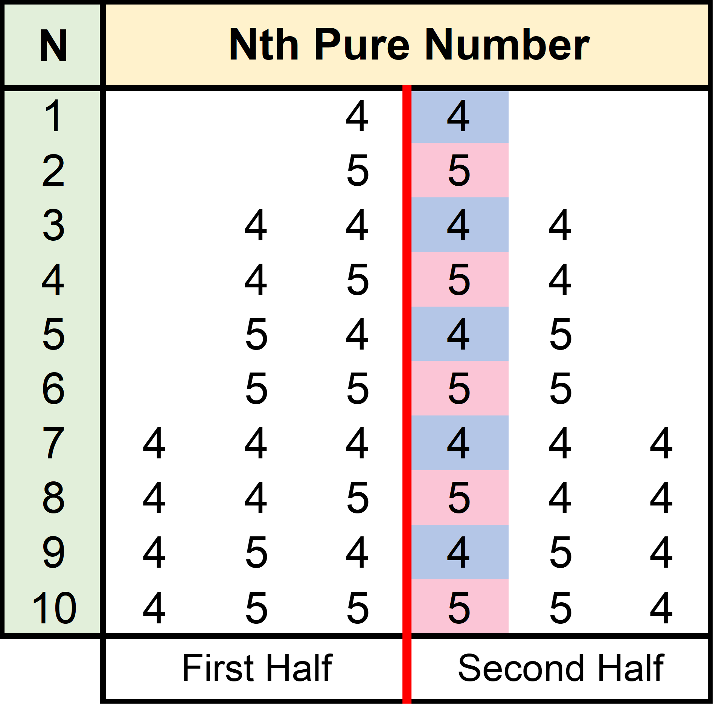
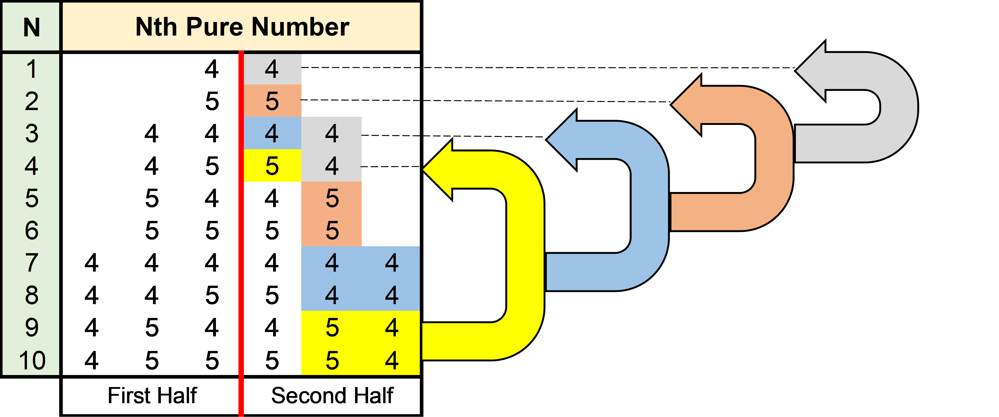

# Pure numbers

Folder Structure
```
Pure numbers
|  images (contains images used by the README.md file)
   |--Algorithm_1st_index.png
   |--Algorithm_2nd_index.png
   |--Purenumbers_Demo.gif
|  Makefile (helpful file for compiling the C++ program)
|  Purenumbers.cpp (C++ source code file)
|  README.md (contains information about the program)
|  out_test (bash script file for automatic input testing)
```

### Table of Contents<hr>
1. [Purpose](#Purpose)<br>
   1.1. [Input Format](#Input_Format)<br>
   1.2. [Output Format](#Output_Format)<br>
   1.3. [Constraints](#Constraints)<br>
   1.4. [Expected Output](#Expected_Output)<br>
   1.5. [Explanation](#Explanation)<br>
2. [Extracted Requirements](#Extracted_Requirements)<br>
3. [Algorithm & Pseudocode](#Algorithm_&_Pseudocode)<br>
4. [Run Instructions](#Run_Instructions)<br>
5. [Program Demo](#Program_Demo)<br>
6. [Code](#Code)<br>

### Purpose <a name="Purpose"></a><hr>
Develop a program that finds the **<em>N<sup>th</sup></em>** pure number, where **<em>N</em>** is an integer provided by the user. A pure number must satisfy the following properties:

1. It comprises of only **4** and **5**.
2. It is a **palindrome** number.
3. The number of digits in a pure number is **even**.

For example, 4444, 5445, 44 are pure numbers while 12, 444, 4545 are not. Pure numbers are to be generated in an ascending order. So, purenumber[1] < purenumber[2].

The first few elements in the list are as follows: 44, 55, 4444, ....

**Input Format** <a name="Input_Format"></a>

- First line: **<em>T</em>** denoting the number of test cases.
- Next **<em>T</em>** lines: A number **<em>N</em>**.

**Output Format** <a name="Output_Format"></a>

- Print the **<em>N<sup>th</sup></em>** pure number.

**Constraints** <a name="Constraints"></a>

1 &le; **<em>T</em>** &le; 10<sup>6</sup><br>
1 &le; **<em>N</em>** &le; 10<sup>6</sup>

**Expected Output** <a name="Expected_Output"></a>

| Sample Input  | Sample Output     |
|:------------: |:-------------:    |
|       3       |       44          |
|       1       |       55          |
|       2       |      4444         |
|       3       |                   |

**Explanation** <a name="Explanation"></a>

Here, **<em>T</em>**=3 meaning there are 3 test cases. In the 1<sup>st</sup> test case **<em>N</em>**=1, so we have to print the 1<sup>st</sup> pure number which is 44. Similarly, in 2<sup>nd</sup> and 3<sup>rd</sup> Test cases, we have to print the 2<sup>nd</sup> and 3<sup>rd</sup> pure number in the series. Hence, we have to print 55 and 4444 respectively.

### Extracted Requirements <a name="Extracted_Requirements"></a><hr>
1. **<em>T</em>** = number of test cases the user will enter. In other words, number of pure numbers to be determined &rightarrow; type int.<br>
2. **<em>N</em>** = number whose N<sup>th</sup> pure number to be calculated. &rightarrow; type int.<br>
3. Pure Number &rightarrow; type string (later convert it to type int).<br>
    3.1. Only contains 4 and 5 &rightarrow; all characters of the pure number string can only contain 4 and 5.<br>
    3.2. Palindrome number &rightarrow; first half of the pure number string = reversed second half string of the pure number.<br>
    3.3. Number of digits are even &rightarrow; length of the pure number string % 2 = 0 (even condition check).<br>
4. Increasing order of Pure number &rightarrow; purenumber[1] &lt; purenumber [2] (pure number must be increasing).<br>

### Algorithm & Pseudocode <a name="Algorithm_&_Pseudocode"></a><hr>
If we look at the first 10 pure numbers, this is what it looks like.

|  N    | Nth Pure Number   |
|:--:   |:---------------:  |
|  1    |        44         |
|  2    |        55         |
|  3    |       4444        |
|  4    |       4554        |
|  5    |       5445        |
|  6    |       5555        |
|  7    |      444444       |
|  8    |      445544       |
|  9    |      454454       |
| 10    |      455554       |

Now if we separate a pure number at the middle into two parts: first half and second half. We can start to notice a pattern in the second half of the pure number as illustrated in **Figure 1** and **Figure 2** below.

| <p align="left">    </p>  | <p align="left">    </p>  |
|:-:    |:-:    |
| **Figure 1**  | **Figure 2**  |

The very first digit of the second half string of the pure number, we can notice that **4** appears on a odd N<sup>th</sup> pure number and **5** appears on the even N<sup>th</sup> pure number. This pattern is highlighted in **Figure 1** for illustration. So, if we are to generate an N<sup>th</sup> pure number and if N is even then, the first digit of the pure number will be **5** and if odd then it will be **4**. Then the remaining digits in the second half string of the N<sup>th</sup> pure number are equivalent to the floor[(N-1)/2] or rounddown[(N-1)/2], as indicated by the arrows in **Figure 2**.

For example, lets say we are calculating the 10<sup>th</sup> pure number, so N = 10. Since 10 is an even number, the first digit of the second half of the pure number string will be 5. Then we get result = 4, from the formula: floor[(10-1)/2]. Now we calculate the 4<sup>th</sup> pure number to get the remaining digits in the second half string of our 10<sup>th</sup> pure number calculation. Since 4 is an even number, the first digit of the second half string of the 4<sup>th</sup> pure number will be 5 as well. Then we get result = 1, from the formula: floor[(4-1)/2]. Now we calculate the second half of the 1<sup>st</sup> pure number. Since 1 is an odd number, the first digit of the second half string of the 1<sup>st</sup> pure number will be 4. Then we get result = 0, from the formula: floor[(1-1)/2] at which point the calculation will terminate. Hence, the second half of the 10<sup>th</sup> pure number is 554. Now that we have the second half of the 10<sup>th</sup> pure number, the first half is a reverse of second half based on the condition that pure numbers are even length, only contain 4 and 5, and are palindrome. Once reversed and combined (i.e. first half + second half), we get the 10<sub>th</sub> pure number to be 455554, which can be confirmed by looking at the 10<sup>th</sup> row of **Figure 2**.

```
Pure number generator algorithm pseudocode
1.    initialize secondPureNumString = "";
2.    while (n>0)
3.    {
4.        Decrement n;
5.        if (n is even)
6.        {
7.            Append 4 to the secondPureNumString;
8.        }
9.        else
10.       {
11.           Append 5 to the secondPureNumString;
12.       }
13.       n = floor(n/2);
14.   }
15.
16.   firstPureNumString = reverse of secondPureNumString;
17.   PureNumString = firstPureNumString + secondPureNumString;
18.   PureNumInt = integer conversion of PureNumString;
19.   return PureNumInt;
```

Since `1%2 = 1` and not `0`, we will decrement n value by `1` as shown in Line # 4 of the algorithm, to have `0%2 = 0` as the terminating condition. Which implies that #4 to be added on even N and #5 to be added on odd N to compensate of -1.

### Run Instructions <a name="Run_Instructions"></a><hr>
Use the provided `Makefile` and `make` command to automatically compile the C++ code on your linux machine. After the compile is successful you can run the program using `./Purenumbers` command in your native terminal. Below is a description of all the supported make commands by the provided makefile.

`make all`: compiles the C++ file into an executable file, `Purenumbers`

`make run`: compiles the C++ file into an executable file, `Purenumbers` and starts the `Purenumbers` program

`make test`: compiles the C++ file into an executable file, `Purenumbers` and provides the `Purenumbers` with sample input from the bash script `out_test`

`make clean`: removes all of the compiled files, `Purenumbers`. Keeps the source code intact

### Program Demo <a name="Program_Demo"></a><hr>
<p align="center">
  
</p>

### Code <a name="Code"></a><hr>
```cpp
#include <iostream> // for User IO
#include <math.h> // for math operations
#include <algorithm> // for reverse string algorithm

using namespace std;

// This function checks if the number of digits are even or odd. 
// If even return true, odd return false
bool isEven(int num)
{
    string temp = to_string(num); // convert num to string
    return ((temp.size()%2) == 0); // check size divisible by 2 to see if even/odd
}

// This function checks if the input num only consists of digits 4 and 5
// Return TRUE: if only 4 and 5 present, FALSE: otherwise
bool checkDigits(int num)
{
    string temp = to_string(num); // convert num to string
    for (int i = 0; i < temp.size(); i++) // loop through the string character by character
    {
        if ((temp[i] != '4') && (temp[i] != '5')) // check for 4 and 5 presence
        {
            return false;
        }
    }
    return true; // only 4 and 5 are present
}

// This function checks if the input num is a palindrome string or not
// Return TRUE: is palindrome, FALSE: not palindrome
bool isPalindrome(int num)
{
    string temp = to_string(num); // convert num to string

    // Divide the string into 2 seperate string at middle
    string first_half = temp.substr(0,temp.size()/2); // extract first half = [0, size()/2)
    string second_half = temp.substr(temp.size()/2, temp.size()); // extract second half = [size()/2, size())
    
    reverse(second_half.begin(), second_half.end()); // reverse the second half
    return (first_half == second_half); // check if the first half equals the reverse second half of the string
}

// This function calculates and returns the Nth pure number
int getNPurenum(int nValue)
{
    string pureNumString = "";
    // Calculate Right half of Nth pure num algorithm
    while(nValue > 0)
    {
        nValue--;
        if(nValue%2 == 0) // even append 4
        {
            pureNumString.append("4"); // Add 4
        }
        else // odd append 5
        {
            pureNumString.append("5"); // Add 5
        }
        nValue = floor(nValue/2); // divide by 2 then round down using floor function        
    }

    // Generate palindrome string for the left half side
    string second_half = pureNumString; // save a copy
    reverse(pureNumString.begin(), pureNumString.end()); // flip to get left side
    pureNumString.append(second_half); // merge left + right side

    return stoi(pureNumString); // convert string to int then return it
}

int main()
{
    // Get # of test cases from the User. T value
    int numTestCases;
    cin >> numTestCases;

    // Check if the input is within the limits as required
    if ((numTestCases < 1) or (numTestCases > pow(10, 6)))
    {
        return 1; // Terminate execution with an error
    }

    int pureNumArray[numTestCases]; // int array to hold all Nth pure numbers

    // Get N number whose pure number is to be calculated
    for (int i = 0; i < numTestCases; i++)
    {
        // Get N from the user and store it in temp
        int temp;
        cin >> temp;

        // Check if the input is within the limits as required
        if ((temp < 1) or (temp > pow(10, 6)))
        {
            return 1; // Terminate execution with an error
        }

        pureNumArray[i] = getNPurenum(temp); // Calculate Nth pure num and add it to array

        // Test for 3 conditions to validate its a pure number
        if (isEven(pureNumArray[i]) && checkDigits(pureNumArray[i]) && isPalindrome(pureNumArray[i]))
        {
            continue;
        }
        else
        {
            return 1; // Terminate execution with error
        }
    }

    // Print Nth pure number from the array
    for (int i = 0; i < numTestCases; i++)
    {
        cout << pureNumArray[i] << endl;
    }
    return 0;
}
```