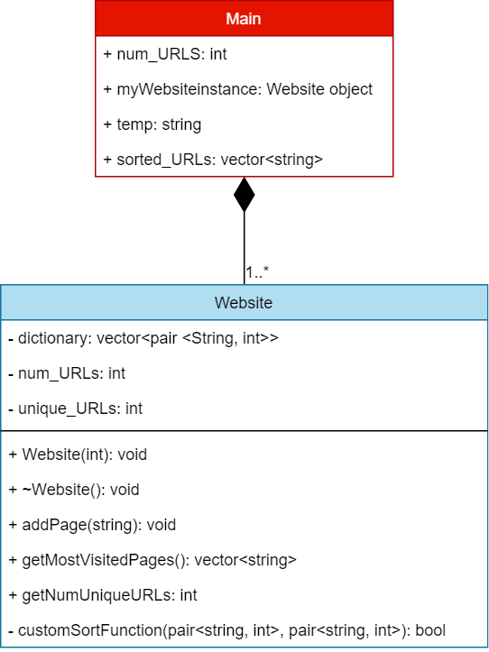

# Sort the URLs

Folder Structure
```
Sort the URLs
|  Makefile (helpful file for compiling the C++ program)
|  README.md (contains information about the program)
|  URLSorter.cpp (C++ source code file)
|  URLSorter_Demo.gif (output from the program)
|  out_test (bash script file for automatic input testing)
```

### Table of Contents
1. [Purpose](#Purpose)</br>
   1.1. [Input Format](#Input_Format)</br>
   1.2. [Output Format](#Output_Format)</br>
   1.3. [Constraints](#Constraints)</br>
   1.4. [Description of classes](#Description_of_classes)</br>
   1.5. [Expected Output](#Expected_Output)</br>
   1.6. [Explanation](#Explanation)</br>
2. [Extracted Requirements](#Extracted_Requirements)
3. [Class Diagram](#Class_Diagram)
4. [Run Instructions](#Run_Instructions)
5. [Program Demo](#Program_Demo)
6. [Code](#Code)

### Purpose <a name="Purpose"></a>

Develop a program that displays the most popular URLs on the basis of a survey which was recently conducted for `N` users. For every user, you are given one URL, which they have already visited. The popularity of a URL, is directly proportional to the number of visits to that URL. The program must sort the URLs in decreasing order of popularity.

**Input Format** <a name="Input_Format"></a>

- First Line: `N`</br>

- Next `N` lines: String `S` (where the <code>i<sup>th</sup></code> line corresponds to the URL that is visited by the <code>i<sup>th</sup></code> user)</br>

**Output Format** <a name="Output_Format"></a>

Print an integer `M` denoting the number of unique URLs accessed by the users and the URLs in decreasing order of popularity in the next `M` lines. If the number of visits of any two URLs is the same, then display them in increasing lexicographical order.</br>

**Constraints** <a name="Constraints"></a>

1 <= N <= 10<sup>5</sup></br>
1 <= |S| <= 100

**Description of classes** <a name="Description_of_classes"></a>

1. Website class </br>
Design a `Website` class that contains an attribute URL of type String. This data stores the URL of the website. The website class must contain a class method named as `getMostVisitedPages` that returns a list containing the most visited URLs in the order as described in the question.</br>
You can use extra attributes or methods in the `Website` class.</br>

2. Main class </br>
This class will be provided to you and it is responsible for taking inputs from the user.</br>

**Expected Output** <a name="Expected_Output"></a><center>

|         Sample Input           |        Sample Output           |
|:---------------------------:   |:---------------------------:   |
|              5                 |              3                 |
| https://www.hackerearth.com    | https://www.hackerearth.com    |
|  https://www.wikipedia.org     |    https://www.google.com      |
|    https://www.google.com      |  https://www.wikipedia.org     |
| https://www.hackerearth.com    |                                |
| https://www.hackerearth.com    |                                |

</center>

**Explanation** <a name="Explanation"></a>

Number of unique url's are 3: https://www.wikipedia.org, https://www.google.com, https://www.hackerearth.com</br>

https://www.hackerearth.com is visited 3 times so it is displayed first, now the number of visits of both the websites https://www.google.com and https://www.wikipedia.org is same, the program needs to display according to the lexicographical order so www.google.com is displayed before www.wikipedia.org.</br>

### Extracted Requirements <a name="Extracted_Requirements"></a>

1. `N` = number of URL's the user will enter &rightarrow; type int</br>
2. `S` = URL visited by the user &rightarrow; type string</br> 
3. `M` = number of unique URL's from the user &rightarrow; type int</br>
4. Sort criteria: </br>
   4.1. Decreasing order of popularity &rightarrow; decreasing `M` value.</br>
   4.2. `M` value same for any URLs &rightarrow; sort by alphabetical order of the url (lexicographical).</br>
5. `Website` class: will take the response from the user entry, count unique URL's and sort it. </br>
   5.1. `getMostVisitedPages`: returns a list containing the most visited URLs in a sorted order. </br>
   5.2. `addPage`: adds a URL to the list.</br>

### Class Diagram <a name="Class_Diagram"></a>

<center></center>
<center>**Created datatype of vector with pairs. Vector(string: URL name, int: URL visit count)**</center></br>

<center></center>

### Run Instructions <a name="Run_Instructions"></a>

Use the provided `Makefile` and `make` command to automatically compile the C++ code on your linux machine. After the compile is successful you can run the program using `./URLSorter` command in your native terminal. Below is a description of all the supported make commands by the provided makefile.

`make all`: compiles the C++ file into an executable file, `URLSorter`

`make run`: compiles the C++ file into an executable file, `URLSorter` and starts the `URLSorter` program

`make test`: compiles the C++ file into an executable file, `URLSorter` and provides the `URLSorter` with sample input from the bash script `out_test`

`make clean`: removes all of the compiled files, `URLSorter`. Keeps the source code intact.

### Program Demo <a name="Program_Demo"></a>
<p align="center">
  
</p>

### Code <a name="Code"></a>
```cpp
#include <iostream> // For User IO
#include <math.h> // For math operations
#include <vector> // For vector data type
#include <algorithm> // For using C++ sort algorithm to sort data

using namespace std;

class Website
{
   public:
      // public variables

      // public functions / members
      Website(int number_of_URL); // Constructor
      ~Website(){}; // Destructor
      void addPage(string page); // Adds the page to the Vector
      vector<string> getMostVisitedPages() const; // Returns a vector of URLs in terms of popularity and sorted order
      int getNumUniqueURLs() const {return unique_URLs;}; // This function will return the number of unique URLs present in the collection
   
   private:
      // private variables
      vector<pair <string, int>> dictionary; // Implementing a vector with (URL name, # of visits)
      int num_URLs; // total number of URLs provided by the user
      int unique_URLs; // total number of Unique URLs present in our vector

      // private functions / members
      static bool customSortFunction(const pair<string, int> &a, const pair<string, int> &b); // static function with custom sort condition
};

Website::Website(int number_of_URL)
{
   num_URLs = number_of_URL; // update the total number of URL's provided by the user
   unique_URLs = 0; // initialize
}

// This function takes two items as a pair (URL name, # of visits) and returns true/false if the item should go first or second when sorting
bool Website::customSortFunction(const pair<string, int> &a, const pair<string, int> &b)
{
   if (a.second == b.second) // If # of visits on the URL are same then sort it by increasing lexicographical order
   {
      return (a.first < b.first); // sort by url name
   }
   else // sort by # of visits
   {
      return (a.second > b.second);
   }
}

// This function adds a URL to our collection
void Website::addPage(string page)
{
   //int original_size = dictionary.size(); // get current # of unique URLs present

   if (unique_URLs == 0) // Add the first item
   {
      dictionary.push_back(make_pair(page,1));
      unique_URLs++; // update number of unique URLs
   }
   else // Dictionary already exists
   {
      bool urlFound = false; // flag to check if URL is present in our collection or not
      for(int i = 0; i < unique_URLs; i++) // loop through existing collection and search for a matching URL
      {
         if (dictionary[i].first == page) // URL exists in our collection
         {
            urlFound = true;
            dictionary[i].second++; // update the # of visits
            break; // exit the for loop as we don't need to search further
         }
      }
      if (urlFound == false) // URL is unique and we need to append it to our collection
      {
         dictionary.push_back(make_pair(page,1)); // add it to our collection and set # of visit to 1 as its new
         unique_URLs++; // update number of unique URLs
      }
   }
   sort(dictionary.begin(), dictionary.end(), customSortFunction); // sort our collection after adding it using the custom sort function
}

// This function will return a vector (list) of unique URLs with sorting applied
vector<string> Website::getMostVisitedPages() const
{
   vector<string> return_list;
   for (int i = 0; i < dictionary.size(); i++) // extract the URL names and return it
   {
      return_list.push_back(dictionary[i].first);
   }
   return return_list;
}

int main()
{
   // Get # of URL's from the User. N value
   int num_URLS;
   cin >> num_URLS;

   // Check if the input is within the limits as required
   if ((num_URLS < 1) or (num_URLS > pow(10,5)))
   {
      return 1; // Terminate execution with an error
   }

   // Create an instance
   Website myWebsiteinstance(num_URLS);

   // Get URL's one by one and add it to our collection of URL's
   string temp; // Temp variable
   for (int i = 0; i < num_URLS; i++)
   {
      cin >> temp;
      myWebsiteinstance.addPage(temp);
   }

   vector<string> sorted_URLs = myWebsiteinstance.getMostVisitedPages(); // get a sorted list of most popular url's
   cout << myWebsiteinstance.getNumUniqueURLs() << endl; // Print # of unique URL's

   // Print the list of most popular url's
   for (int i = 0; i < myWebsiteinstance.getNumUniqueURLs(); i++)
   {
      cout << sorted_URLs[i] << endl;
   }
   return 0;
}
```